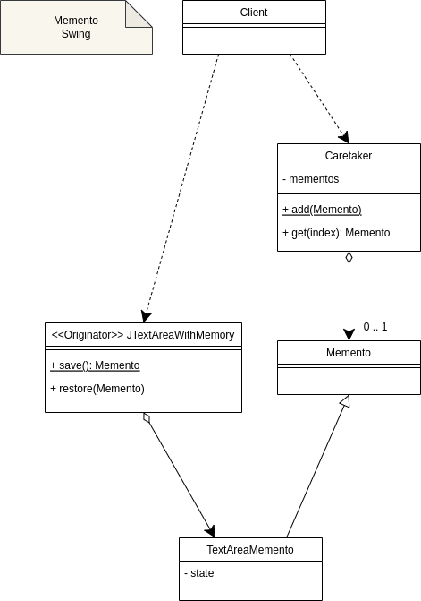

  <h3 align="center">Padrões de projeto estruturais</h3>

  

    Padrões estruturais são voltados aos algoritmos e a designação de responsabilidades entre objetos.
  

<!-- TABLE OF CONTENTS -->

  
Índice

  <ol>
    <li>
      <a href="#Chain-of-Responsibility">Chain of Responsibility</a>
    </li>
    <li>
      <a href="#Memento">Memento</a>
    </li>
    <li>
      <a href="#Command">Command</a>
    </li>
    <li>
      <a href="#Iterator">Iterator</a>
    </li>
    <li>
      <a href="#Observer">Observer</a>
    </li>
    <li>
      <a href="#State">State</a>
    </li>
    <li>
      <a href="#Strategy">Strategy</a>
    </li>
    <li>
      <a href="#Template-Method">Template Method</a>
    </li>
    <li>
      <a href="#Mediator">Mediator</a>
    </li>

# Chain of Responsibility

Também conhecido como: CoR, Corrente de responsabilidade, Corrente de comando, Chain of command

O Chain of Responsibility é um padrão de projeto comportamental que permite que você passe pedidos por uma corrente de handlers. Ao receber um pedido, cada handler decide se processa o pedido ou o passa adiante para o próximo handler na corrente.

## Objetivo do projeto

- Apresentar o problema geral
- Apresentar uma solução utilizando o chain of responsability
- Ver como uma aplicação pode ser criada juntando peças atômicas

## Problemas

- Como posso evitar o acoplamento entre o remetente de uma solicitação e seu receptor?
- Como permitir que mais que um objeto possa atender alguma requisição?

## Solução

- Definir uma cadeia de objetos onde cada um poderá responder aquela solicitação ou enviar para o próximo objeto tratá-la.
- Quem faz a solicitação não precisa saber o tamanho de cadeia, ou mesmo como (por quem) ela será resolvida.

## GOF

> Evita acoplar o remetente de uma requisição ao seu destinatário ao dar a mais de um obejto a chance de servir a requisição. Compõe os objetos em cascata e passa a requisição pela corrente até que um objeto a sirva.

## Modelo Chain of Responsability (before) Bills Dispenser

  

## Modelo Chain of Responsability (after) Bills Dispenser

  

## Modelo Chain of Responsability Service Process

  

## Código

[Ver aqui](https://github.com/danielso2007/padroes_de_projeto_estruturais)

# Memento

**Também conhecido como**: Lembrança, Retrato, Snapshot.

O Memento é um padrão de projeto comportamental que permite que você salve e restaure o estado anterior de um objeto sem revelar os detalhes de sua implementação.

## Objetivo do projeto

- Apresentar o problema geral
- Apresentar uma solução utilizando o memento

## Problemas

- Como um objeto pode capturar seu estado interno para poder ser restaurado posteriormente?

## Solução

- Definir uma estratura de memento onde cada estado poderá ser salvo e restaurado quando necessário

## GOF

> Sem violar o encapsulamento, capturar e externalizar o estado interno de um objeto para que o objeto possa ter esse estado restaurado posteriormente.

## Modelo Memento Swing

  

## Código

[Ver aqui](https://github.com/danielso2007/padroes_de_projeto_estruturais)

# Command

**Também conhecido como**: Comando, Ação, Action, Transação, Transaction.

O Command é um padrão de projeto comportamental que transforma um pedido em um objeto independente que contém toda a informação sobre o pedido. Essa transformação permite que você parametrize métodos com diferentes pedidos, atrase ou coloque a execução do pedido em uma fila, e suporte operações que não podem ser feitas.

## Objetivo do projeto

- Apresentar o problema geral
- Apresentar uma solução utilizando o command
- Apresentar como estratégias de migração podem trabalhar utilizando command

## Problemas

- Como posso representar uma requisição dentro de um objeto?
- Preciso fazer uma requisição mas não sei como ela será resolvida ou até mesmo quem irá respondeê-la?

## Solução

- Encapsular a requisição em um objeto command separado
- O comando não tem os detalhes de quem e será resolvido

## GOF

> Encapsular uma requisição como um objeto, permitindo que clientes parametrizem diferentes requisições, filas ou requisições de log, e suportar operações reversíveis.

## Modelo Command Alexa (Before)

  

## Modelo Command Alexa (After)

  

## Modelo Command Migrations

  

## Código

[Ver aqui](https://github.com/danielso2007/padroes_de_projeto_estruturais)

# Iterator

O Iterator é um padrão de projeto comportamental que permite a você percorrer elementos de uma coleção sem expor as representações dele (lista, pilha, árvore, etc.)

## Objetivo do projeto

- Apresentar o problema geral
- Apresentar uma solução utilizando o iterator
- Ver como este padrão se integra completamente com laços e streams

## Problemas

- Como passo navegar através de uma coleção de obejtos sem a necessidade de conhecer os detalhes desta estratura?

## Solução

- Encapsular a lógica de navegação entre os elementos desta coleção em uma estratura de iterator

## GOF

> Prover uma maneira de acessar os elementos de um obejto agragado squencialmente sem expor sua representação interna.

## Modelo

  

## Código

[Ver aqui](https://github.com/danielso2007/padroes_de_projeto_estruturais)

# Observer

**Também conhecido como**: Observador, Assinante do evento, Event-Subscriber, Escutador, Listener.

O Observer é um padrão de projeto comportamental que permite que você defina um mecanismo de assinatura para notificar múltiplos objetos sobre quaisquer eventos que aconteçam com o objeto que eles estão observando.

## Objetivo do projeto

- Apresentar o problema geral
- Apresentar uma solução utilziando o observer
- Aprender a reduzir a quantidade de requisições apenas com a troca de responsabilidade

## Problemas

- Como posso modelar um relacionamento 1-N sem deixar todos eles acoplados?
- Como um obejto pode notificar outros objetos quando necessário?

## Solução

- Criar uma estrutura de observer para que ele possa notificar todos os objetos que solicitaram ser avisados quando um determinado evento ocorra

## GOF

> Definir uma dependência um-para-muitos entre objetos para que quando um objeto mudar de estado, todos os seus dependentes sejam notificados e atualizados automaticamente.

## Modelo

  

## Código

[Ver aqui](https://github.com/danielso2007/padroes_de_projeto_estruturais)

# State

O State é um padrão de projeto comportamental que permite que um objeto altere seu comportamento quando seu estado interno muda. Parece como se o objeto mudasse de classe.

## Objetivo do projeto

- Apresentar o problema geral
- Apresentar uma solução utilizando o state
- Ver como jogos podem ser representados com este padrão

## Problemas

- Como posso alterar o comportamento de um obejto quando seu estado interno muda?
- Como permitir que novos comportamentos sejam adicionados e integrados com os demais?

## Solução

- Modelar os comportamentos possíveis através de states
- Definir como serão realizadas as mudanças de estados
- Cada state irá tomar controle de execução de acordo com o estado interno do objeto

## GOF

> Permitir a um objeto alterar o seu comportamento quanto a seu estado interno mudar. O objeto irá aparentar mudar de classe.

## Modelo

  

## Código

[Ver aqui](https://github.com/danielso2007/padroes_de_projeto_estruturais)

# Strategy

O Strategy é um padrão de projeto comportamental que permite que você defina uma família de algoritmos, coloque-os em classes separadas, e faça os objetos deles intercambiáveis.

## Objetivo do projeto

- Apresentar o problema geral
- Apresentar uma solução utilziando o strategy
- Filosofar um pouco sobre a sua existência

## Problemas

- Como uma classe pode utilizar um algoritmo definido dinamicamente?
- Como posso selecionar e trocar uma lógica em tempo de execução?

## Solução

- Encapsular os algoritmos possíveis para o mesmo problema em uma estratura de strategy
- O cliente irá delegar a execução para estas estratégias ao invés de possuir toda a lógica internamente

## GOF

> Definir uma família de algoritmo, encapsular cada um, e fazê-lo intercambiáveis. Strategy permite que algoritmos mudem independentemente entre clientes que os utilizam.

## Modelo

  

## Código

[Ver aqui](https://github.com/danielso2007/padroes_de_projeto_estruturais)

# Template Method

O Template Method é um padrão de projeto comportamental que define o esqueleto de um algoritmo na superclasse mas deixa as subclasses sobrescreverem etapas específicas do algoritmo sem modificar sua estrutura.

## Objetivo do projeto

- Apresentar o problema geral
- Apresentar uma solução utilizando o template method
- Apresentar uma forma de modelar lógicas complexas reaproveitando muito código

## Problemas

- Como posso unir partes de um código que não variam com partes variáveis?
- Como posso alterar certos pontos de código mantendo uma estrutura geral?

## Solução

- Definir uma abstração com todas os pontos que podem ser variados
- Criar um template que contenha as partes fixas e possua pontos de chamadas para as partes variáveis

## GOF

> Definir o esuqeleto de um algoritmo dentro de uma operação, deixando alguns passos a serem preenchidos pelas subclasses. Template Method permite que suas subclasses redefinam certos passos de um algoritmo sem mudar sua estrutura.

## Modelo

  

## Código

[Ver aqui](https://github.com/danielso2007/padroes_de_projeto_estruturais)

# Mediator

**Também conhecido como**: Mediador, Intermediário, Intermediary, Controlador, Controller.

O Mediator é um padrão de projeto comportamental que permite que você reduza as dependências caóticas entre objetos. O padrão restringe comunicações diretas entre objetos e os força a colaborar apenas através do objeto mediador.

## Objetivo do projeto

- Apresentar o problema geral
- Apresentar uma solução utilziando o mediator

## Problemas

- Como posso reduzir o acoplamento entre objetos que precisam se comunicar?
- Como posso deixar a interação entre objetos mais dinâmica?

## Solução

- Utilizar uma estrutura de mediator para encapsular a forma em que os objetos se comunicarão
- Os objetos não precisam se conhecer, pois toda a interação será realizada através do mediator

## GOF

> Definir um objeto que encapsula como um conjunto de obejtos interagem. Mediator promove acoplamento fraco ao manter objetos que não se referem um ao outro explicitamente, permitindo variar sua interação independentemente.

## Modelo

  

## Código

[Ver aqui](https://github.com/danielso2007/padroes_de_projeto_estruturais)